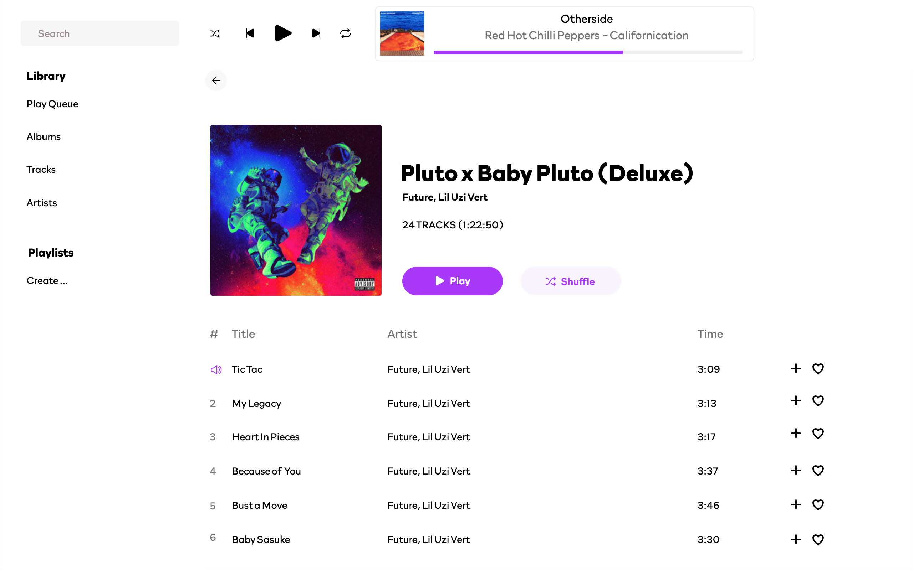
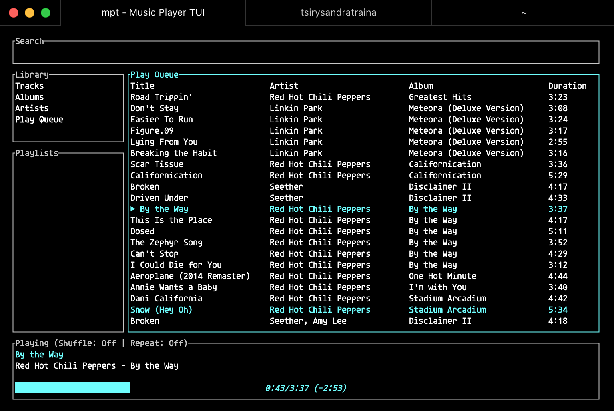
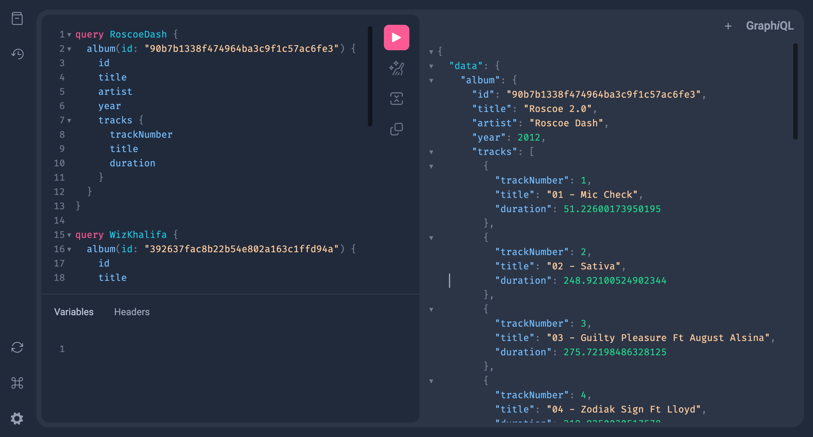

## Music Player (written in Rust)

<p>
  <a href="https://flakehub.com/flake/tsirysndr/music-player" target="_blank">
    
  </a>
  <a href="https://flakestry.dev/flake/github/tsirysndr/music-player" target="_blank">
    
  </a>
  <a href="LICENSE" target="_blank">
    
  </a>
  <a href="https://buf.build/tsiry/musicserverapis/docs/main:music.v1alpha1">
    
  </a>
  <a href="https://crates.io/crates/music-player" target="_blank">
    
  </a>
   <a href="https://crates.io/crates/music-player" target="_blank">
    
  </a>
  <a href="https://codecov.io/gh/tsirysndr/music-player" target="_blank">
    
  </a>
  <a href="https://github.com/tsirysndr/music-player/releases" target="_blank">
    
   </a>
  <a href="https://github.com/tsirysndr/music-player/actions/workflows/ci.yml" target="_blank">
    
  </a>
   <a href="https://github.com/tsirysndr/music-player/actions/workflows/release.yml" target="_blank">
    
  </a>
  <a href="https://github.com/tsirysndr/music-player/actions/workflows/rust-clippy.yml" target="_blank">
    
  </a>
  <a href="https://feat-webui--6343b23f7b47cd6de45a5849.chromatic.com/" target="_blank">
  
  </a>
  <a href="https://discord.gg/reJ9gUNsMV" target="_blank">
    
  </a>
</p>

<p style="margin-top: 20px; margin-bottom: 50px;">

</p>

<p style="margin-top: 20px; margin-bottom: 50px;">

</p>

Note: This is a work in progress. 🏗️🚧

This is a simple music player that I made for my own use. It is written in Rust and uses [rodio](https://github.com/RustAudio/rodio), [symphonia](https://github.com/pdeljanov/Symphonia), and [gRPC](https://grpc.io/) libraries.<br />
Music is played through the server's audio device. The daemon stores info about all available music, and this info can be easily searched and retrieved.
Like [mpd](https://github.com/MusicPlayerDaemon/MPD) or [Mopidy](https://github.com/mopidy/mopidy) but written in Rust.

<p style="margin-top: 20px; margin-bottom: 20px;">
  
</p>

## Installation

Compiling from source, without Nix:

```bash
# Install dependencies
brew install protobuf # macOS
sudo apt-get install -y libasound2-dev protobuf-compiler # Ubuntu/Debian
choco install protoc # Windows using Chocolatey Package Manager
# Compile
git clone https://github.com/tsirysndr/music-player.git
cd music-player/webui/musicplayer
nvm install # install node version specified in .nvmrc (optional on windows)
bun install && bun run build # build webui
cd ../..
cargo install --path .
```

With Nix:

```bash
git clone https://github.com/tsirysndr/music-player.git
cd music-player
nix develop --experimental-features "nix-command flakes"
cd webui/musicplayer
bun install && bun run build # build webui
cd ../..
cargo install --path .
```

### macOS/Linux

Using [Homebrew](https://brew.sh/):

```bash
brew install tsirysndr/tap/musicplayer
```

Using [Nix](https://nixos.org/):

```bash
nix profile install --experimental-features "nix-command flakes" github:tsirysndr/music-player
```

Or download the latest release for your platform [here](https://github.com/tsirysndr/music-player/releases).

## 📦 Downloads

<!-- download start -->

**Latest (Desktop):**

- `Mac`: arm64: [music-player-desktop_v0.2.0-alpha.12_aarch64-apple-darwin.tar.gz](https://github.com/tsirysndr/music-player/releases/download/v0.2.0-alpha.12/music-player-desktop_v0.2.0-alpha.12_aarch64-apple-darwin.tar.gz) intel: [Music_Player_v0.2.0-alpha.12_x64.dmg](https://github.com/tsirysndr/music-player/releases/download/v0.2.0-alpha.12/Music_Player_v0.2.0-alpha.12_x64.dmg)
- `Linux`: [music-player_v0.2.0-alpha.12_amd64.deb](https://github.com/tsirysndr/music-player/releases/download/v0.2.0-alpha.12/music-player_v0.2.0-alpha.12_amd64.deb)
- `Windows`: [Music_Player_x64_en-US.msi](https://github.com/tsirysndr/music-player/releases/download/v0.2.0-alpha.12/Music_Player_x64_en-US.msi)

**Latest (CLI):**

- `Mac`: arm64: [music-player_v0.2.0-alpha.12_aarch64-apple-darwin.tar.gz](https://github.com/tsirysndr/music-player/releases/download/v0.2.0-alpha.12/music-player_v0.2.0-alpha.12_aarch64-apple-darwin.tar.gz) intel: [music-player_v0.2.0-alpha.12_x86_64-apple-darwin.tar.gz](https://github.com/tsirysndr/music-player/releases/download/v0.2.0-alpha.12/music-player_v0.2.0-alpha.12_x86_64-apple-darwin.tar.gz)
- `Linux`: [music-player_v0.2.0-alpha.12_x86_64-unknown-linux-gnu.tar.gz](https://github.com/tsirysndr/music-player/releases/download/v0.2.0-alpha.12/music-player_v0.2.0-alpha.12_x86_64-unknown-linux-gnu.tar.gz)
- `Windows`: [music-player_x86_64-pc-windows-gnu.tar.gz](https://github.com/tsirysndr/music-player/releases/download/v0.2.0-alpha.12/music-player_x86_64-pc-windows-gnu.tar.gz)

[Other version...](https://github.com/tsirysndr/music-player/releases)


## Start the server

```bash
music-player
```

## Usage

```
USAGE:
    music-player [SUBCOMMAND]

OPTIONS:
    -h, --help       Print help information
    -V, --version    Print version information

SUBCOMMANDS:
    albums      List all albums
    artists     List all artists
    help        Print this message or the help of the given subcommand(s)
    next        Play the next song
    pause       Pause the current song
    open        Open audio file
    playlist    Manage playlists
    prev        Play the previous song
    queue       Manage the queue
    play        Resume the current song
    scan        Scan music library: $HOME/Music
    search      Search for a song, album, artist or playlist
    stop        Stop the current song
    tracks      List all tracks
```

### GraphQL API

```bash
# Start the server
music-player
```

Open [http://localhost:5053/graphiql](http://localhost:5053/graphiql) in your browser.

<p style="margin-top: 20px; margin-bottom: 20px;">
 
</p>

### Features

- [x] Play music from specified path
- [x] Configuration file support
- [x] [gRPC API](https://buf.build/tsiry/musicserverapis/docs/main:music.v1alpha1) for controlling the player
- [x] Scan music library
- [x] Play/Pause/Stop music
- [x] Next/Previous track
- [x] Create/Delete playlists
- [x] Music Player Client
- [x] Terminal UI (using [tui-rs](https://github.com/fdehau/tui-rs))
- [x] GraphQL API 
- [x] Web UI
- [ ] Desktop version (using [gtk-rs](https://gtk-rs.org/))
- [x] Android Library (See [songbird-android](https://github.com/tsirysndr/songbird-android) and [songbird-android-rs](https://github.com/tsirysndr/songbird-android-rs))
- [ ] iOS Library
- [ ] Mobile version (React Native)
- [x] Stream to Chromecast
- [ ] Stream to Airplay
- [x] Stream to Kodi
- [x] Stream to UPnP Media Renderer
- [ ] Stream from Youtube (audio only)
- [ ] Stream from Spotify
- [ ] Stream from Soundcloud
- [ ] Stream from Deezer
- [ ] Stream from DatPiff
- [ ] Stream from Tidal
- [ ] Stream from [MyVazo](https://myvazo.com/)

## ✨ Star History

<picture>
  <source media="(prefers-color-scheme: dark)" srcset="https://api.star-history.com/svg?repos=tsirysndr/music-player&type=Date&theme=dark" />
  <source media="(prefers-color-scheme: light)" srcset="https://api.star-history.com/svg?repos=tsirysndr/music-player&type=Date" />
  
</picture>

