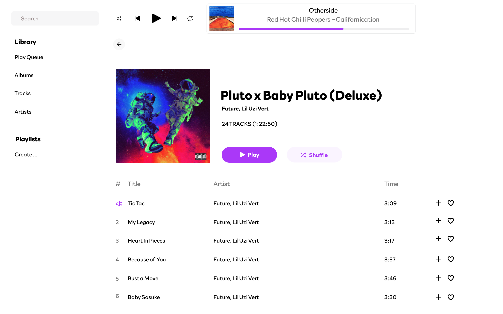
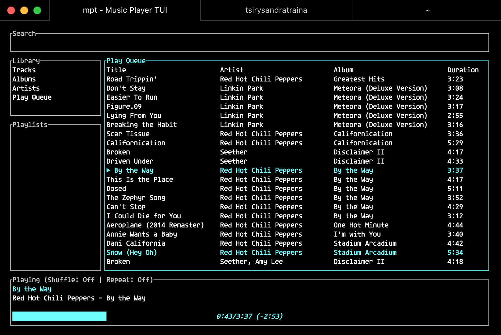
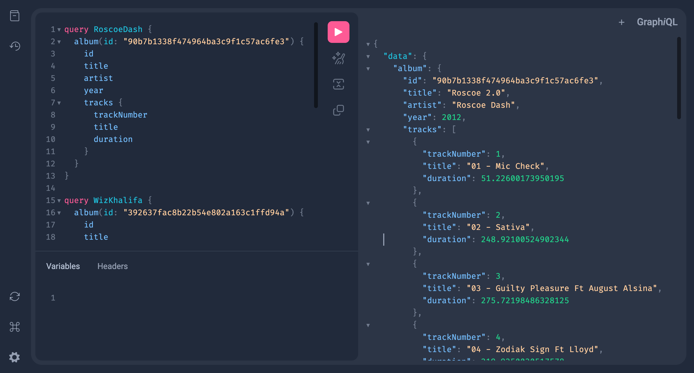

## Music Player (written in Rust)

<p>
  <a href="https://flakehub.com/flake/tsirysndr/music-player" target="_blank">
    
  </a>
  <a href="LICENSE" target="_blank">
    
  </a>
  <a href="https://buf.build/tsiry/musicserverapis/docs/main:music.v1alpha1">
    
  </a>
  <a href="https://crates.io/crates/music-player" target="_blank">
    
  </a>
   <a href="https://crates.io/crates/music-player" target="_blank">
    
  </a>
  <a href="https://codecov.io/gh/tsirysndr/music-player" target="_blank">
    
  </a>
  <a href="https://github.com/tsirysndr/music-player/releases" target="_blank">
    
   </a>
  <a href="https://github.com/tsirysndr/music-player/actions/workflows/ci.yml" target="_blank">
    
  </a>
   <a href="https://github.com/tsirysndr/music-player/actions/workflows/release.yml" target="_blank">
    
  </a>
  <a href="https://github.com/tsirysndr/music-player/actions/workflows/rust-clippy.yml" target="_blank">
    
  </a>
  <a href="https://feat-webui--6343b23f7b47cd6de45a5849.chromatic.com/" target="_blank">
  
  </a>
  <a href="https://discord.gg/reJ9gUNsMV" target="_blank">
    
  </a>
</p>

<p style="margin-top: 20px; margin-bottom: 50px;">

</p>

<p style="margin-top: 20px; margin-bottom: 50px;">

</p>

An extensible music player daemon, server and client, written in Rust — like [mpd](https://github.com/MusicPlayerDaemon/MPD) or [Mopidy](https://github.com/mopidy/mopidy).

Audio decoding and playback are powered by the [Rockbox](https://www.rockbox.org) firmware's battle-tested engine, via the [rockbox-playback](https://crates.io/crates/rockbox-playback), [rockbox-dsp](https://crates.io/crates/rockbox-dsp) and [rockbox-metadata](https://crates.io/crates/rockbox-metadata) crates: 40+ audio formats, gapless-grade buffering, EQ/crossfade/ReplayGain DSP, and native HTTP streaming. The daemon indexes your library into SQLite (with FTS5 full-text search) and exposes it over gRPC, GraphQL and a web UI — controllable from the terminal UI, the browser, or the Tauri desktop app.

> [!NOTE]
> **Looking for more?**
> If you're interested in this project, you might want to check out [Rockbox Zig](https://github.com/tsirysndr/rockbox-zig),
> a music player daemon built on the [Rockbox](https://www.rockbox.org) Open Source Firmware. It offers advanced audio playback
> features, bringing the best of Rockbox to modern platforms with the power of [Zig](https://ziglang.org/) and [Rust](https://www.rust-lang.org).
>

<p style="margin-top: 20px; margin-bottom: 20px;">
  
</p>

## Table of Contents

- [Features](#features)
- [Installation](#installation)
- [Start the server](#start-the-server)
- [Usage](#usage)
- [Terminal UI](#terminal-ui)
- [Web UI & Desktop](#web-ui--desktop)
- [GraphQL API](#graphql-api)
- [Search](#search)
- [Configuration](#configuration)
  - [Audio output](#audio-output)
  - [Subsonic / Navidrome & Jellyfin](#subsonic--navidrome--jellyfin)
  - [Rocksky scrobbling](#rocksky-scrobbling)
- [Casting](#casting)
- [Star History](#star-history)

## Features

- 🎵 **Rockbox playback engine** — 40+ formats (MP3, FLAC, Vorbis, Opus, MP4/AAC/ALAC, WavPack, APE, WMA, chiptunes, …) with the Rockbox DSP chain (EQ presets, crossfade, ReplayGain)
- 🔎 **Instant full-text search** backed by SQLite FTS5, kept in sync automatically by database triggers
- 🖥️ **Terminal UI** (ratatui) with an fzf-style fuzzy finder, neovim-inspired status line and `?` help overlay
- 🌐 **Web UI** (React 18 + TanStack Query + Jotai) with live progress and seek/fast-forward
- 🖱️ **Desktop app** built on Tauri 2
- 📡 **gRPC + GraphQL APIs** (tonic 0.14, grpc-web enabled) for building your own clients
- ☁️ **Browse & stream from Subsonic/Navidrome and Jellyfin servers**
- 📻 **Cast to Chromecast and UPnP/DLNA renderers**, or control another music-player daemon
- 🎧 **Rocksky scrobbling** — scrobble your plays to [Rocksky](https://rocksky.app) on the AT Protocol
- 🔌 Flexible **audio output**: system device (cpal), stdout, FIFO, Unix or TCP socket

## Installation

Compiling from source, without Nix:

```bash
# Install dependencies
brew install protobuf # macOS
sudo apt-get install -y libasound2-dev protobuf-compiler # Ubuntu/Debian
choco install protoc # Windows using Chocolatey Package Manager
# Compile
git clone https://github.com/tsirysndr/music-player.git
cd music-player/webui/musicplayer
nvm install # install node version specified in .nvmrc (optional on windows)
bun install && bun run build # build webui
cd ../..
cargo install --path .
```

With Nix:

```bash
git clone https://github.com/tsirysndr/music-player.git
cd music-player
nix develop --experimental-features "nix-command flakes"
cd webui/musicplayer
bun install && bun run build # build webui
cd ../..
cargo install --path .
```

Using [npm](https://www.npmjs.com/) (downloads the prebuilt binary from GitHub releases):

```bash
npm install -g @tsiry/music-player   # or: npx @tsiry/music-player
# pin a specific release: MUSIC_PLAYER_VERSION=v0.2.0 npx @tsiry/music-player
```

### macOS/Linux

Using [Homebrew](https://brew.sh/):

```bash
brew install tsirysndr/tap/musicplayer
```

Using [Nix](https://nixos.org/):

```bash
cachix use tsirysndr
nix profile install --experimental-features "nix-command flakes" github:tsirysndr/music-player
```

Or download the latest release for your platform [here](https://github.com/tsirysndr/music-player/releases).

## 📦 Downloads

<!-- download start -->

**Latest (Desktop):**

- `Mac`: arm64: [music-player-desktop_v0.2.0_aarch64-apple-darwin.tar.gz](https://github.com/tsirysndr/music-player/releases/download/v0.2.0/music-player-desktop_v0.2.0_aarch64-apple-darwin.tar.gz) intel: [Music_Player_v0.2.0_x64.dmg](https://github.com/tsirysndr/music-player/releases/download/v0.2.0/Music_Player_v0.2.0_x64.dmg)
- `Linux`: [music-player_v0.2.0_amd64.deb](https://github.com/tsirysndr/music-player/releases/download/v0.2.0/music-player_v0.2.0_amd64.deb)
- `Windows`: [Music_Player_x64_en-US.msi](https://github.com/tsirysndr/music-player/releases/download/v0.2.0/Music_Player_x64_en-US.msi)

**Latest (CLI):**

- `Mac`: arm64: [music-player_v0.2.0_aarch64-apple-darwin.tar.gz](https://github.com/tsirysndr/music-player/releases/download/v0.2.0/music-player_v0.2.0_aarch64-apple-darwin.tar.gz) intel: [music-player_v0.2.0_x86_64-apple-darwin.tar.gz](https://github.com/tsirysndr/music-player/releases/download/v0.2.0/music-player_v0.2.0_x86_64-apple-darwin.tar.gz)
- `Linux`: [music-player_v0.2.0_x86_64-unknown-linux-gnu.tar.gz](https://github.com/tsirysndr/music-player/releases/download/v0.2.0/music-player_v0.2.0_x86_64-unknown-linux-gnu.tar.gz)
- `Windows`: [music-player_x86_64-pc-windows-gnu.tar.gz](https://github.com/tsirysndr/music-player/releases/download/v0.2.0/music-player_x86_64-pc-windows-gnu.tar.gz)

[Other version...](https://github.com/tsirysndr/music-player/releases)


## Start the server

```bash
music-player
```

The daemon scans your music directory (`$HOME/Music` by default), serves gRPC on `:5051`, WebSocket events on `:5052`, and the web UI + GraphQL on `:5053`.

## Usage

```
USAGE:
    music-player [SUBCOMMAND]

OPTIONS:
    -h, --help       Print help information
    -V, --version    Print version information

SUBCOMMANDS:
    albums      List all albums
    artists     List all artists
    help        Print this message or the help of the given subcommand(s)
    next        Play the next song
    pause       Pause the current song
    open        Open audio file
    playlist    Manage playlists
    prev        Play the previous song
    queue       Manage the queue
    play        Resume the current song
    scan        Scan music library: $HOME/Music
    search      Search for a song, album, artist or playlist
    stop        Stop the current song
    tracks      List all tracks
```

## Terminal UI

Run `music-player` while a daemon is running (or connect to a remote one with `music-player connect -s <host>`) to open the TUI. It ships with:

- an **fzf-style fuzzy finder** (`/`) over tracks, albums and artists, ranked as you type with match highlighting
- a **neovim-inspired status line**: mode indicator, now playing, position/duration, volume, and the connected server
- a context-sensitive **keybinding hint bar**, and a full help overlay on `?`

Main keys:

| Key | Action |
| --- | --- |
| `?` | Help overlay with all keybindings |
| `/` | Fuzzy search (Tab switches Tracks/Albums/Artists scope) |
| `Space` | Play / pause |
| `n` / `p` | Next / previous track |
| `<` / `>` | Seek −5s / +5s |
| `+` / `-` | Volume up / down |
| `z` | Add selected track to the queue |
| `q` / `Esc` | Back / quit |

## Web UI & Desktop

The web UI is served by the daemon at [http://localhost:5053](http://localhost:5053) — React 18, TanStack Query and Jotai, with live playback position (GraphQL subscriptions) and a seekable progress bar.

The desktop app wraps the same UI with [Tauri 2](https://v2.tauri.app):

```bash
cd webui/musicplayer
bun install
bun run tauri dev   # or: bun run tauri build
```

## GraphQL API

```bash
# Start the server
music-player
```

Open [http://localhost:5053/graphiql](http://localhost:5053/graphiql) in your browser.

<p style="margin-top: 20px; margin-bottom: 20px;">
 
</p>

## Search

The library is indexed into **SQLite FTS5** virtual tables that are kept in sync by database triggers — no separate index to maintain, and search works instantly over tracks (title/artist/album/genre), albums and artists with prefix matching:

```bash
music-player search "fire"        # CLI
# GraphQL: query { search(keyword: "fire") { tracks { title } albums { title } artists { name } } }
```

## Configuration

Settings live in `~/.config/music-player/settings.toml` (created on first run). Every key can also be set through a `MUSIC_PLAYER_*` environment variable (e.g. `MUSIC_PLAYER_HTTP_PORT=5053`).

```toml
music_directory = "/home/me/Music"
port = 5051        # gRPC
ws_port = 5052     # WebSocket events
http_port = 5053   # Web UI + GraphQL
device_name = "Music Player"
library_refresh_interval = 30  # rescan the music directory every N minutes (0 = off)
```

The library can also be refreshed manually at any time — `music-player scan` from the CLI, or the `scan` mutation in GraphQL. Re-scans only pick up what's new; existing entries are untouched.

### Audio output

By default audio goes to the system output device. `audio_output` redirects the decoded stream (raw S16LE stereo) somewhere else:

```toml
audio_output = "cpal"              # system audio device (default)
audio_output = "stdout"            # raw PCM to stdout
audio_output = "fifo:/tmp/mp.pcm"  # named pipe
audio_output = "unix:/tmp/mp.sock" # unix socket
audio_output = "tcp:0.0.0.0:9000"  # tcp socket, e.g.: ffplay -f s16le -ar 44100 -ac 2 tcp://host:9000
```

### Subsonic / Navidrome & Jellyfin

Browse and stream your remote library from any Subsonic-compatible server ([Navidrome](https://www.navidrome.org/), Airsonic, gonic) or [Jellyfin](https://jellyfin.org/):

```toml
subsonic_url = "https://music.example.com"
subsonic_username = "alice"
subsonic_password = "secret"

jellyfin_url = "https://jellyfin.example.com"
jellyfin_username = "alice"
jellyfin_password = "secret"
```

Restart the daemon: the servers show up as source devices (in the web UI's device picker, or `listDevices` in GraphQL). Connect to one and its artists/albums/tracks/playlists are browsable, with tracks streamed straight from the server.

### Rocksky scrobbling

If you're logged into [Rocksky](https://rocksky.app) (`rocksky login` writes `~/.rocksky/token.json`), the daemon scrobbles what you play — using the classic rule (half the track, or 4 minutes, whichever comes first). Disable it with:

```toml
scrobble = false
```

## Casting

Playback isn't limited to the machine running the daemon — from the web UI or GraphQL you can cast to:

- **Chromecast** devices
- **UPnP/DLNA** media renderers
- another **music-player** daemon on your network (auto-discovered via mDNS)

## ✨ Star History

<picture>
  <source media="(prefers-color-scheme: dark)" srcset="https://api.star-history.com/svg?repos=tsirysndr/music-player&type=Date&theme=dark" />
  <source media="(prefers-color-scheme: light)" srcset="https://api.star-history.com/svg?repos=tsirysndr/music-player&type=Date" />
  
</picture>
