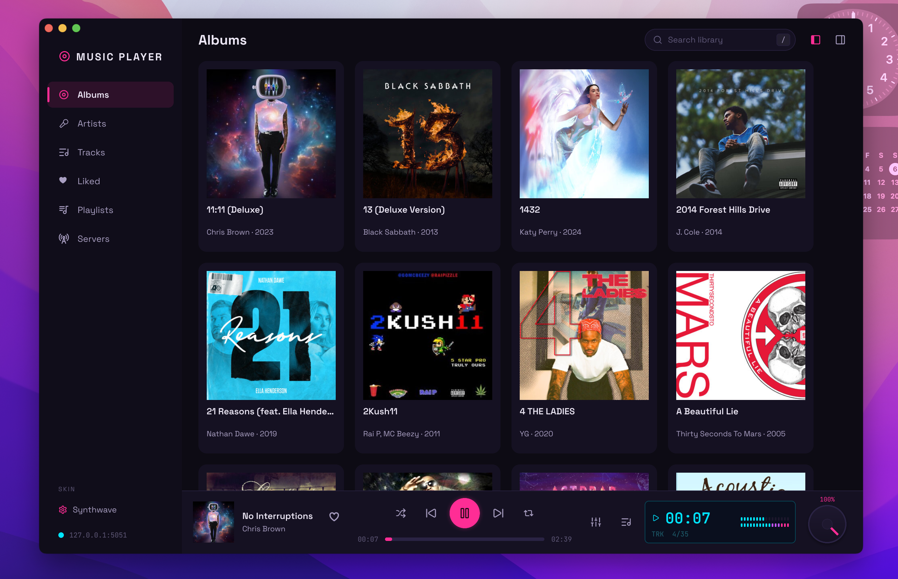

# music-player-desktop — Slint client for music-player

A modern, skinnable desktop app for the
[music-player](../README.md) daemon, built with [Slint](https://slint.dev).
Inspired by jetAudio (VFD readout), Mixxx (LED level meters, LateNight
palette), Cambridge Audio (lunar-grey hi-fi restraint), FL Studio / VST synth
UIs (neon accents).


## Features

- **Embedded daemon** — if nothing is listening on the gRPC port
  (`127.0.0.1:5051` by default), the app boots a full in-process daemon:
  player engine, gRPC + websocket servers, GraphQL webui (with `/covers/`
  album art), library scanner, Rocksky scrobbler and mDNS discovery. If a
  daemon is already running it just connects as a remote control.
- **Library browser** — Albums grid (with cover art), Artists, Tracks, Liked
  and Playlists; album detail page (art, year, track count, total duration,
  per-disc grouping, per-track play, shuffle); per-track/album context
  actions (play next, add to queue, add to playlist, like).
- **Playlists** — create, rename, delete; open a playlist to add tracks
  (searchable picker) or remove them; play from anywhere including the
  command palette. Backed by the daemon's PlaylistService, so playlists are
  shared with every other client.
- **Liked tracks** — heart any track (or a whole album) and find it in the
  Liked tab. The daemon has no favorites concept, so likes are the desktop
  app's own (`desktop_liked.json` in the config dir) — and every heart is
  forwarded to [Rocksky](https://rocksky.app) when a `rocksky login` token
  exists.
- **Artist pictures** — filled in batch from the Rocksky API after every
  library scan (`artist.picture` in the daemon DB) and shown in the Artists
  list.
- **Media keys** — on macOS the app publishes to the system Now Playing
  center (Control Center, media keys, AirPods controls); on Linux the
  embedded daemon registers MPRIS, so playerctl and desktop widgets work.
- **Server switcher** — a palette listing the embedded daemon, every
  `music-player` daemon discovered on the LAN (mDNS), saved
  Subsonic/Jellyfin servers, and free-form `host[:port]` — pick one to
  repoint the whole app at it.
- **Remote servers** — add Subsonic/Navidrome or Jellyfin servers from the
  Servers tab and browse their Albums / Artists / Playlists; anything you
  play streams straight into the daemon's queue (the engine plays http
  natively).
- **Transport** — play/pause, prev/next, seek, volume, shuffle toggle, repeat
  cycle (off → all → one), all applied to the daemon over gRPC.
- **Queue drawer** — Play Queue / History tabs, pinned Now Playing card, Up
  Next list; click any row to jump, remove single tracks or clear the queue.
- **Queue resume** — the daemon persists the queue and the exact position
  (`cache/queue.json`, refreshed every 5 s and on every track change) and
  comes back cued **paused** where it left off after a restart.
- **Audio settings** — press `e` (or the equalizer button in the player bar)
  for the full DSP surface: 10-band parametric EQ with precut, bass/treble/
  balance knobs, ReplayGain (mode, pre-amp, clipping guard), crossfade (mode,
  fade in/out delay + duration, mix mode) and output dithering. Everything
  persists in the `[audio]` table of `settings.toml` and is re-applied to the
  engine at boot.
- **Rocksky** — when a token from `rocksky login` exists
  (`~/.rocksky/token.json`), the daemon scrobbles plays (half the track or
  4 minutes) and registers as a **remote player** device, so it shows up in
  the Rocksky web/desktop miniplayer device picker for transport + audio
  settings control. Disable either with `scrobble = false` /
  `remote_player = false` in `settings.toml`. (Remote queue control is off
  for now — the daemon plays the local library, not the Rocksky library.)
- **Command palette** — press `/` (or click the search box) for a
  Search overlay for tracks, albums and artists (with cover art
  thumbnails); `↑`/`↓` + `enter` to play. `?` shows the keyboard-shortcut
  help.
- **VFD display** — jetAudio-style readout with elapsed time, queue position
  (`TRK 3/12`), codec, bitrate, sample rate and animated LED VU meters.
- **Extensions** — the Extensions tab lists every installed WebAssembly
  extension with its version, what it plugs into, and what it asked to reach
  (network hosts, library access). Switch one on or off from its row, narrow
  the list with the All/Enabled/Disabled chips or the search box, and rescan
  for anything added or removed on disk while the app is open. It reads the
  manifests rather than loading the modules, so opening the tab costs a
  directory walk; the enabled flag lives in the `extension` table and is shared
  with the daemon and the web UI. A module already loaded keeps running until
  the daemon next starts. Installing and scaffolding stay with
  `music-player extension`.
- **Skins** — five bundled (`Synthwave` default, `Late Night`, `Neutron`,
  `Lunar`, `Porcelain`); click the SKIN entry in the sidebar (or press `s`)
  to cycle. The choice persists in the music-player config directory
  (`desktop-skin`).

## Keyboard shortcuts

| Key         | Action                        |
| ----------- | ----------------------------- |
| `/`         | Search library                |
| `space`     | Play / pause                  |
| `e`         | Audio settings (EQ)           |
| `s`         | Cycle skin                    |
| `q`         | Show / hide the play queue    |
| `b`         | Show / hide the sidebar       |
| `f`         | Fullscreen player (while playing) |
| `↑` / `↓`   | Navigate search results       |
| `enter`     | Play selection                |
| `esc`       | Close dialog / go back        |
| `?`         | Show the shortcut help        |

## Build

```sh
# The webui is embedded into the daemon at compile time — build it once:
cd webui/musicplayer && bun install && bun run build && cd ../..

# The app itself:
cargo build --release -p music-player-desktop
# → target/release/music-player-desktop
```

Environment overrides: `MUSIC_PLAYER_HOST`, `MUSIC_PLAYER_PORT` (gRPC, 5051),
`MUSIC_PLAYER_HTTP_PORT` (5053, used for `/covers/` album art). Set
`MUSIC_PLAYER_HOST` to a remote address and the app never boots a local
daemon.

Releases: the `release-slint-desktop` GitHub workflow (manually triggerable,
or on release creation) builds and uploads `aarch64-apple-darwin`,
`x86_64-unknown-linux-gnu` and `aarch64-unknown-linux-gnu` binaries to the
GitHub release.

## Skins

A skin is a TOML file of design tokens — colors, radii, font families — that
Rust loads into the Slint `Theme` global at runtime (`src/skin.rs`). Drop
extra `.toml` files into the `skins/` folder of the music-player config
directory (e.g. `~/Library/Application Support/music-player/skins/` on macOS,
`~/.config/music-player/skins/` on Linux) and they join the cycle; copy
`skins/synthwave.toml` as a template. Malformed color values render loud
magenta so they're easy to spot.

| File                    | Vibe                                                  |
| ----------------------- | ----------------------------------------------------- |
| `skins/synthwave.toml`  | Neon magenta/cyan on deep violet (Serum / synthwave)  |
| `skins/late-night.toml` | Mixxx LateNight PaleMoon — teal VFD, burnt amber      |
| `skins/neutron.toml`    | FL Studio graphite + signal orange, lime channel glow |
| `skins/lunar.toml`      | Cambridge Audio lunar grey + warm lamp amber          |
| `skins/porcelain.toml`  | Light jetAudio silver deck, cool blue display         |

## Configuration

Everything lives in the daemon's `settings.toml` (music-player config
directory). Keys the desktop app cares about:

```toml
port = 5051            # gRPC
http_port = 5053       # GraphQL webui + /covers/
scrobble = true        # Rocksky scrobbling (needs `rocksky login`)
remote_player = true   # Rocksky remote-player device (needs `rocksky login`)

# Optional: search with Typesense instead of the built-in SQLite FTS5 index.
# When present, the daemon re-syncs the songs/albums/artists collections
# after every library scan and falls back to FTS5 if the server is down.
[typesense]
url = "http://localhost:8108"
api_key = "xyz"

[audio]                # persisted DSP state, written by the app
eq_enabled = false
eq_precut = 0.0
eq_band_gains = [0.0, 0.0, 0.0, 0.0, 0.0, 0.0, 0.0, 0.0, 0.0, 0.0]
bass = 0
treble = 0
balance = 0
replaygain_mode = 3    # 0 track, 1 album, 2 track (shuffle), 3 off
replaygain_preamp = 0.0
replaygain_noclip = false
crossfade = 0          # 0 off … 5 always
fade_in_delay = 0
fade_in_duration = 2
fade_out_delay = 0
fade_out_duration = 2
fade_out_mixmode = 0   # 0 crossfade, 2 mix
dithering = false
```

Saved remote servers live next to it in `desktop_servers.json`, liked track
ids in `desktop_liked.json`.

## Architecture

```
ui/app.slint         window, sidebar, views, player bar, overlays (palette,
                     help, queue drawer, album detail, audio settings,
                     server browser)
ui/components.slint  IconButton, PlayPauseButton, SlideBar, MeterStrip,
                     VfdDisplay, AlbumCard, TrackRow, EqBandSlider, Knob,
                     Toggle, Dropdown, ServerRow, BrowseRow, ExtensionRow, …
ui/theme.slint       Theme global — every visual token, overwritten per skin
ui/icons.slint       Icons global — Lucide-style SVGs (assets/icons)
src/main.rs          UI-thread state (thread_local), callbacks, skin cycling
src/rpc.rs           tokio worker: tonic clients, 1 s status/queue polling,
                     command loop, Subsonic/Jellyfin browsing
src/extensions.rs    manifest-only scan of the installed extensions, and the
                     search over them (no module is instantiated)
src/servers.rs       saved remote servers (desktop_servers.json)
src/skin.rs          skin TOML loading + Theme application + persistence
src/daemon.rs        embedded daemon boot (mirrors src/main.rs server mode)
assets/icon.svg      app icon source (synthwave note); regenerate with:
                     inkscape -o icon_1024.png -w 1024 assets/icon.svg,
                     iconutil for AppIcon.icns, sips for the webui logos
build.rs             Slint compile (fluent-dark base style)
```

Threading model: the tokio worker owns all gRPC I/O and pushes plain data to
the UI thread with `Weak::upgrade_in_event_loop`; library state lives in a
`thread_local` on the UI thread. UI callbacks send `Cmd` values over an
unbounded channel back to the worker. music-player has no server-streaming
RPCs, so now-playing and the queue are polled once a second (a local ticker
animates the elapsed time and VU meters in between).

Icon rule: **no emoji / Unicode glyphs as icons** — only the SVGs referenced
by `ui/icons.slint` (tinted via `Image.colorize`, so they follow every skin).
